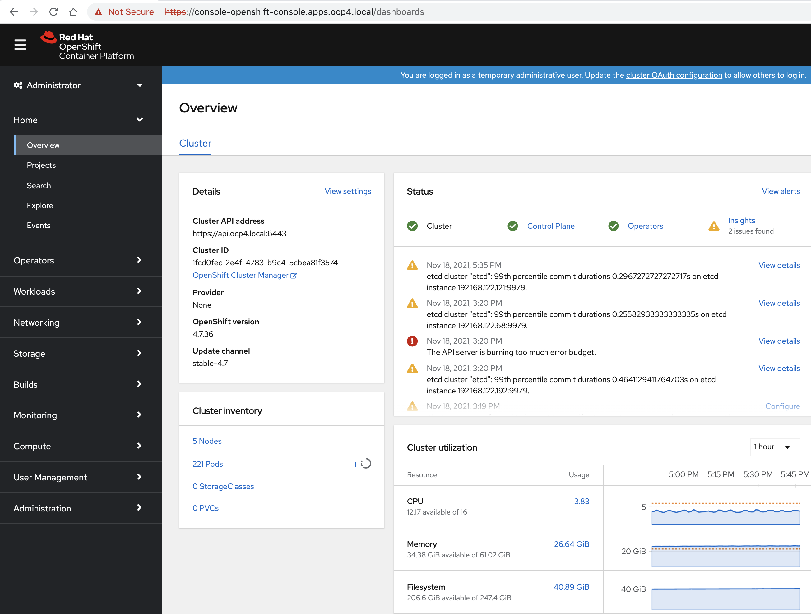

# Step-by-step SELinux / Security Profiles Operator demo on OpenShift 4


# Libvirt host
Dell PowerEdge R440, Xeon(R) Silver 4114 CPU @ 2.20GHz, 20 cores, 128GB Ram, 4-2TB disks


```
ssh user@vb1237.mydomain.com
```


```
[root@vb1237 user]# cat /etc/centos-release
CentOS Linux release 8.2.2004 (Core)
```

# Update

```
dnf update -y
```

# Install modules and packages 
```
dnf -y module install virt
dnf -y install haproxy zip podman buildah skopeo libvirt*  bind-utils wget tar gcc python3-devel python3  xauth virt-install virt-viewer virt-manager libguestfs-tools-c libguestfs-tools tmux httpd-tools git x3270-x11 nc net-tools
```


## Ensure you have enough space in root partition

```
[user@vb1237 ~]$ cd /
[user@vb1237 /]$ exec sudo su
[root@vb1237 /]# fuser -kim  /dev/cl_vb1237/home
[root@vb1237 /]# umount -f /dev/cl_vb1237/home
[root@vb1237 /]# lvremove /dev/cl_vb1237/home

Do you really want to remove active logical volume cl_vb1237/home? [y/n]: y
Logical volume "home" successfully removed
```
 
```
[root@vb1237 /]# lvextend -An -l +100%FREE -r /dev/cl_vb1237/root
Size of logical volume cl_vb1237/root changed from 50.00 GiB (12800 extents) to 1.81 TiB (475651 extents).
Logical volume cl_vb1237/root successfully resized.
meta-data=/dev/mapper/cl_vb1237-root isize=512    agcount=4, agsize=3276800 blks
....
data blocks changed from 13107200 to 487066624
```

# Disable IPv6

Append below lines in /etc/sysctl.conf:

```
net.ipv6.conf.all.disable_ipv6 = 1
net.ipv6.conf.default.disable_ipv6 = 1
```

```
sysctl -p
```

# Use AddressFamily inet

Add the AddressFamily line to sshd_config :

```
vi /etc/ssh/sshd_config
....
AddressFamily inet
....
```


Restart sshd for changes to get effect :

```
systemctl restart sshd
```

# OpenShift pull secret
Copy the pull secret from https://cloud.redhat.com/openshift/install/pull-secret to /root/pull-secret


```
yum update libgcrypt
```
(because https://bugzilla.redhat.com/show_bug.cgi?id=1925029)


# Libvirtd
```
systemctl start libvirtd.service
systemctl enable libvirtd
```

```
systemctl status libvirtd
[root@vb1237 user]# systemctl status libvirtd
● libvirtd.service - Virtualization daemon
   Loaded: loaded (/usr/lib/systemd/system/libvirtd.service; enabled; vendor preset: enabled)
   Active: active (running) since Thu 2021-11-18 10:25:52 PST; 2s ago
     Docs: man:libvirtd(8)
           https://libvirt.org
 Main PID: 33147 (libvirtd)
    Tasks: 19 (limit: 32768)
   Memory: 24.3M
   CGroup: /system.slice/libvirtd.service
           ├─33147 /usr/sbin/libvirtd --timeout 120
           ├─33341 /usr/sbin/dnsmasq --conf-file=/var/lib/libvirt/dnsmasq/default.conf --leasefile-ro --dhcp-script=/usr/libexec/libvirt_leaseshelper
           └─33342 /usr/sbin/dnsmasq --conf-file=/var/lib/libvirt/dnsmasq/default.conf --leasefile-ro --dhcp-script=/usr/libexec/libvirt_leaseshelper

Nov 18 10:25:54 vb1237.mydomain.com dnsmasq[33341]: started, version 2.79 cachesize 150
Nov 18 10:25:54 vb1237.mydomain.com dnsmasq[33341]: compile time options: IPv6 GNU-getopt DBus no-i18n IDN2 DHCP DHCPv6 no-Lua TFTP no-conntrack ipset auth DNSS>
Nov 18 10:25:54 vb1237.mydomain.com dnsmasq-dhcp[33341]: DHCP, IP range 192.168.122.2 -- 192.168.122.254, lease time 1h
Nov 18 10:25:54 vb1237.mydomain.com dnsmasq-dhcp[33341]: DHCP, sockets bound exclusively to interface virbr0
Nov 18 10:25:54 vb1237.mydomain.com dnsmasq[33341]: reading /etc/resolv.conf
Nov 18 10:25:54 vb1237.mydomain.com dnsmasq[33341]: using nameserver 172.17.64.15#53
Nov 18 10:25:54 vb1237.mydomain.com dnsmasq[33341]: using nameserver 172.21.64.15#53
Nov 18 10:25:54 vb1237.mydomain.com dnsmasq[33341]: read /etc/hosts - 2 addresses
Nov 18 10:25:54 vb1237.mydomain.com dnsmasq[33341]: read /var/lib/libvirt/dnsmasq/default.addnhosts - 0 addresses
Nov 18 10:25:54 vb1237.mydomain.com dnsmasq-dhcp[33341]: read /var/lib/libvirt/dnsmasq/default.hostsfile
```

# Dnsmasq

As root, setup a separate dnsmasq server on the host:

```
fuser -k 53/tcp
dnf  -y install dnsmasq
for x in $(virsh net-list --name); do virsh net-info $x | awk '/Bridge:/{print "except-interface="$2}'; done > /etc/dnsmasq.d/except-interfaces.conf
sed -i '/^nameserver/i nameserver 127.0.0.1' /etc/resolv.conf
systemctl restart dnsmasq
systemctl enable dnsmasq

systemctl status  dnsmasq
   dnsmasq.service - DNS caching server.
   Loaded: loaded (/usr/lib/systemd/system/dnsmasq.service; enabled; vendor preset: disabled)
   Active: active (running) since Thu 2021-11-18 10:27:01 PST; 2s ago
 Main PID: 33481 (dnsmasq)
    Tasks: 1 (limit: 820844)
   Memory: 720.0K
   CGroup: /system.slice/dnsmasq.service
           └─33481 /usr/sbin/dnsmasq -k

Nov 18 10:27:01 vb1237.mydomain.com systemd[1]: Started DNS caching server..
Nov 18 10:27:01 vb1237.mydomain.com dnsmasq[33481]: started, version 2.79 cachesize 150
Nov 18 10:27:01 vb1237.mydomain.com dnsmasq[33481]: compile time options: IPv6 GNU-getopt DBus no-i18n IDN2 DHCP DHCPv6 no-Lua TFTP no-conntrack ipset auth DNSS>
Nov 18 10:27:01 vb1237.mydomain.com dnsmasq[33481]: reading /etc/resolv.conf
Nov 18 10:27:01 vb1237.mydomain.com dnsmasq[33481]: ignoring nameserver 127.0.0.1 - local interface
Nov 18 10:27:01 vb1237.mydomain.com dnsmasq[33481]: using nameserver 172.17.64.15#53
Nov 18 10:27:01 vb1237.mydomain.com dnsmasq[33481]: ignoring nameserver 127.0.0.1 - local interface
Nov 18 10:27:01 vb1237.mydomain.com dnsmasq[33481]: using nameserver 172.21.64.15#53
Nov 18 10:27:01 vb1237.mydomain.com dnsmasq[33481]: read /etc/hosts - 2 addresses
```


```
git clone https://github.com/kxr/ocp4_setup_upi_kvm.git
cd ocp4_setup_upi_kvm/
```

# Use separate dnsmasq (not NetworkManager's)

```
[root@vb1237 ocp4_setup_upi_kvm]# vim .defaults.sh
```

Set
```
# -z, --dns-dir DIR
export DNS_DIR="/etc/dnsmasq.d"
```

# Adjust defaults in .defaults.sh

Adjust defaults as needed (no of master, no of workers, CPU, mem)


```
systemctl stop NetworkManager
systemctl disable NetworkManager
```

```
cat /etc/resolv.conf
nameserver 127.0.0.1
nameserver 8.8.8.8
```

# Add sleep 10 

```
vim ./.install_scripts/create_nodes.sh
```

add sleep 10:

```
echo -n "====> Resstarting libvirt and dnsmasq: "
systemctl restart libvirtd || err "systemctl restart libvirtd failed"
systemctl restart dnsmasq || err "systemctl $DNS_CMD $DNS_SVC"; ok

echo -n "====> waiting 10 "
sleep 10


echo -n "====> Configuring haproxy in LB VM: "
```

# Start the OpenShift install

```
./ocp4_setup_upi_kvm.sh --ocp-version 4.7.stable -y
```


```
######################################################
#### OPENSHIFT 4 INSTALLATION FINISHED SUCCESSFULLY###
######################################################
          time taken = 72 minutes

INFO Waiting up to 40m0s for the cluster at https://api.ocp4.local:6443 to initialize...
INFO Waiting up to 10m0s for the openshift-console route to be created...
INFO Install complete!
INFO To access the cluster as the system:admin user when using 'oc', run 'export KUBECONFIG=/root/ocp4_cluster_ocp4/install_dir/auth/kubeconfig'
INFO Access the OpenShift web-console here: https://console-openshift-console.apps.ocp4.local
INFO Login to the console with user: "kubeadmin", and password: "RXtvq-DNWX4-kFZnN-Dsuqh"
INFO Time elapsed: 0s
[root@vb1238 ocp4_setup_upi_kvm]#
```

# Expose the cluster outside the host via HAProxy


## Generate the HAProxy config
```
[root@vb1238 ocp4_cluster_ocp4]# cd /root/ocp4_cluster_ocp4/

[root@vb1238 ocp4_cluster_ocp4]# ./expose_cluster.sh --method haproxy

######################
### HAPROXY CONFIG ###
######################

# haproxy configuration has been saved to: /tmp/haproxy-z6uz.cfg Please review it before applying
# To apply, simply move this config to haproxy. e.g:

      mv '/tmp/haproxy-z6uz.cfg' '/etc/haproxy/haproxy.cfg'

# haproxy can be used to front multiple clusters. If that is the case,
# you only need to merge the 'use_backend' lines and the 'backend' blocks from this confiugration in haproxy.cfg

# You will also need to open the ports (80,443 and 6443) e.g:

      firewall-cmd --add-service=http
      firewall-cmd --add-service=https
      firewall-cmd --add-port=6443/tcp
      firewall-cmd --runtime-to-permanent

# If SELinux is in Enforcing mode, you need to tell it to treat port 6443 as a webport, e.g:

      semanage port -a -t http_port_t -p tcp 6443


[NOTE]: When accessing this cluster from outside make sure that cluster FQDNs resolve from outside

        For basic api/console access, the following /etc/hosts entry should work:

        <IP-of-this-host> api.ocp4.local console-openshift-console.apps.ocp4.local oauth-openshift.apps.ocp4.local
```        

## Apply the HAProxy config

```
[root@vb1238 ocp4_cluster_ocp4]#  mv '/tmp/haproxy-x15l.cfg' '/etc/haproxy/haproxy.cfg'
mv: overwrite '/etc/haproxy/haproxy.cfg'? y
[root@vb1238 ocp4_cluster_ocp4]# systemctl restart haproxy
[root@vb1238 ocp4_cluster_ocp4]# systemctl status  haproxy
   haproxy.service - HAProxy Load Balancer
   Loaded: loaded (/usr/lib/systemd/system/haproxy.service; disabled; vendor preset: disabled)
   Active: active (running) since Thu 2021-11-18 16:26:44 PST; 4s ago
  Process: 154123 ExecStartPre=/usr/sbin/haproxy -f $CONFIG -c -q $OPTIONS (code=exited, status=0/SUCCESS)
 Main PID: 154127 (haproxy)
    Tasks: 2 (limit: 820844)
   Memory: 3.1M
   CGroup: /system.slice/haproxy.service
           ├─154127 /usr/sbin/haproxy -Ws -f /etc/haproxy/haproxy.cfg -p /run/haproxy.pid
           └─154129 /usr/sbin/haproxy -Ws -f /etc/haproxy/haproxy.cfg -p /run/haproxy.pid

Nov 18 16:26:44 vb1238.mydomain.com systemd[1]: Starting HAProxy Load Balancer...
Nov 18 16:26:44 vb1238.mydomain.com systemd[1]: Started HAProxy Load Balancer.
```

On your laptop, add the following to /etc/hosts:

```
<IP-of-libvirt-host> api.ocp4.local console-openshift-console.apps.ocp4.local oauth-openshift.apps.ocp4.local
```

```
cp /root/ocp4_cluster_ocp4/oc /usr/bin
export KUBECONFIG=/root/ocp4_cluster_ocp4/install_dir/auth/kubeconfig
oc get nodes
```


```
[root@vb1238 ~]# oc get nodes
NAME                  STATUS   ROLES           AGE     VERSION
master-1.ocp4.local   Ready    master,worker   3h30m   v1.20.0+bbbc079
master-2.ocp4.local   Ready    master,worker   3h30m   v1.20.0+bbbc079
master-3.ocp4.local   Ready    master,worker   3h30m   v1.20.0+bbbc079
worker-1.ocp4.local   Ready    worker          3h7m    v1.20.0+bbbc079
worker-2.ocp4.local   Ready    worker          3h7m    v1.20.0+bbbc079
```

From your laptop, you can now browse to the OpenShift console:





# OpenShift Container Storage

Variations from the OCS setup at https://github.com/marcredhat/ocs.git:

```
1) mount each additional SSD to /disk1, /disk2, /disk3

2) created 500GB /disk[1-3]/disk[1-5].img volumes and attached to kvm domains using virtio on vd[b-d] and 
the --config option, then sequentially restarted domains to verify the drives mount

3) for the libvirt version with CentOS 8.2 and the virtio drives, 
provided the paths for the local storage operator as:
     devicePaths:
        - /dev/disk/by-path/pci-0000:07:00.0
        - /dev/disk/by-path/pci-0000:08:00.0
        - /dev/disk/by-path/pci-0000:09:00.0
        
Ended up using the operator for OCS and then manually scaling the sets. 

With drives on 5 (not a multiple of 3) the sets got propagated out in a suboptimal way and 
did not get fully utilized.
```

# Cloudera Datalake cluster
The Cloudera Datalake cluster can also be installed on libvirt (for testing) and fully automated via Ansible.


# Install Security Profiles Operator
The operator container image consists of an image manifest which supports the architectures amd64 and arm64 for now. 
To deploy the operator, first install cert-manager via kubectl:

```
kubectl apply -f https://github.com/jetstack/cert-manager/releases/download/v1.6.0/cert-manager.yaml
kubectl --namespace cert-manager wait --for condition=ready pod -l app.kubernetes.io/instance=cert-manager
```

Then apply the operator manifest:
```
kubectl apply -f https://raw.githubusercontent.com/kubernetes-sigs/security-profiles-operator/master/deploy/operator.yaml
```

# Set verbosity, enableLogEnricher and enableSelinux

```
kubectl -n security-profiles-operator patch spod/spod --type=merge -p '{"spec":{"verbosity":1}}
kubectl -n security-profiles-operator patch spod/spod --type=merge -p '{"spec":{"enableLogEnricher": true, "enableSelinux": true}}'
```


# Check that enableLogEnricher and enableSelinux are set to "true"

```
oc get spod -n security-profiles-operator -oyaml | grep enable
    enableLogEnricher: true
    enableSelinux: true
```

# Create a test Deployment

```
oc create -f https://raw.githubusercontent.com/marcredhat/rke2selinux/main/marcdeploy.yaml
```

# Check the Deployment's labels

```
oc get deploy marc --show-labels
NAME   READY   UP-TO-DATE   AVAILABLE   AGE     LABELS
marc   1/1     1            1           4m55s   app=marc
```

# Create ProfileRecording using the Deployment's label

```
apiVersion: security-profiles-operator.x-k8s.io/v1alpha1
kind: ProfileRecording
metadata:
  name: test-recording
spec:
  kind: SelinuxProfile
  recorder: logs
  podSelector:
    matchLabels:
      app: marc
```


```
oc get pods -o yaml | grep selinuxrecording  -B 1
              seLinuxOptions:
                type: selinuxrecording.process
```


# Delete the pods and check that the SELinuxProfile is created


```
oc delete pod -l app=marc
```

```
oc get selinuxprofiles
NAME                         USAGE                                        STATE
test-recording-hello-app-0   test-recording-hello-app-0_default.process   InProgress
```


# Check the generated SELinux policy

```
oc get selinuxprofiles -oyaml | grep "policy: |" -A 4
    policy: |
      (blockinherit container)
      (allow process http_cache_port_t ( tcp_socket ( name_bind )))
      (allow process node_t ( tcp_socket ( node_bind )))
      (allow process test-recording-hello-app-0_default.process ( tcp_socket ( listen )))
```


#  Install the generated SELinux policy

**Get the "usage" as shown below**

```
oc get selinuxprofiles -oyaml | grep usage
usage: test-recording-hello-app-0_default.process
```

**Edit the Deployment to use it**

```
securityContext:
          runAsUser: 1000
          seLinuxOptions:
            type: test-recording-hello-app-0_default.process
```


# Check the Deployment's SELinux type
```            
oc get deploy -oyaml | grep seLinuxOptions -A 3 | grep process
                  type: test-recording-hello-app-0_default.process
```


#  Check the containers' logs

```
oc logs -l app=marc
2021/11/23 00:07:43 Server listening on port 8080
2021/11/23 00:12:00 Serving request: /
```

# Check the Security Profile Operator Daemon's logs

```
...
oc logs -l name=spod --all-containers -n security-profiles-operator
            I1122 23:38:08.773602 1747109 main.go:305] Listening securely on 0.0.0.0:9443
            {"level":"info","ts":1637624285.648324,"caller":"daemon/daemon.go:29","msg":"Started daemon"}
            {"level":"info","ts":1637624286.0449376,"logger":"state-server","caller":"daemon/status_server.go:183","msg":"Serving status","path":"/var/run/selinuxd/selinuxd.sock","uid":0,"gid":65535}
            {"level":"info","ts":1637624286.0452702,"caller":"daemon/status_server.go:72","msg":"Status Server got READY signal"}
            {"level":"info","ts":1637625439.4213052,"logger":"file-watcher","caller":"daemon/daemon.go:92","msg":"Installing policy","file":"/etc/selinux.d/test-recording-hello-app-0_default.cil"}
            {"level":"info","ts":1637625439.4214282,"logger":"file-watcher","caller":"daemon/daemon.go:92","msg":"Installing policy","file":"/etc/selinux.d/test-recording-hello-app-0_default.cil"}
            {"level":"info","ts":1637625470.354372,"logger":"policy-installer","caller":"daemon/daemon.go:130","msg":"The operation was successful","operation":"install - /etc/selinux.d/test-recording-hello-app-0_default.cil"}
            {"level":"info","ts":1637625470.3556492,"logger":"policy-installer","caller":"daemon/daemon.go:130","msg":"The operation was successful","operation":"install - /etc/selinux.d/test-recording-hello-app-0_default.cil"}
            time="2021-11-22T23:20:54Z" level=info msg="Trying to copy file /opt/spo-profiles/..data/selinuxd.cil to /var/lib/kubelet/seccomp/..data/selinuxd.cil (required: false)"
            time="2021-11-22T23:20:54Z" level=info msg="Copied selinuxd.cil"
...          
```


# Get the OpenShift node where the app is running 


```
oc get pods -o wide
NAME                    READY   STATUS    RESTARTS   AGE   IP            NODE                  NOMINATED NODE   READINESS GATES
marc-66d658c675-cpc89   1/1     Running   0          14m   10.130.0.89   master-3.ocp4.local   <none>           <none>
```


# On the OpenShift node, check that our app's containers run with the correct SELinux type from the recording

```
ssh -i /root/ocp4_cluster_ocp4/sshkey core@master-3.ocp4.local
```

```
[core@master-3 ~]$ ps -efZ | grep hello-app | grep selinux
system_u:system_r:selinuxrecording.process:s0:c273,c750 core 3606119 3606107  0 00:07 ? 00:00:00 ./hello-app
```

